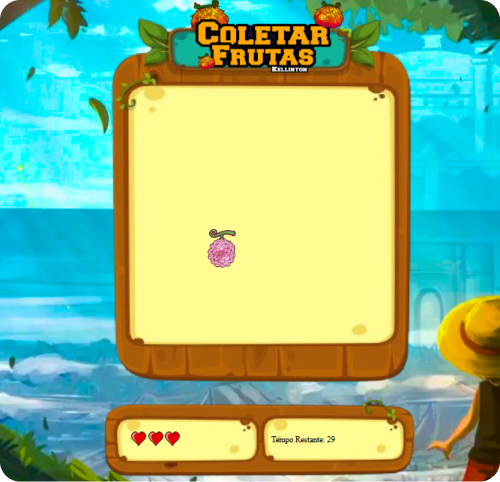

## JSGame Fruit Catcher - One Piece 

# Capture the Fruits - Game inspired by One Piece

Welcome to "Capture the Fruits", an exciting game inspired by the epic world of One Piece. Your mission is to capture as many fruits as you can before the time runs out.

## Screenshot

### Technologies Used

- HTML5 for the structure of the game.
- JavaScript for programming logic, style and interactivity.

### Functionalities

- **Score System**: Track your score as you progress through the game and challenge your friends to beat it by clicking on the fruits.

- **Four Levels of Difficulty**: Choose your level from Supernova, Shichibukai, Admiral, and Yonkou. Each level offers a different challenge with faster gameplay.

